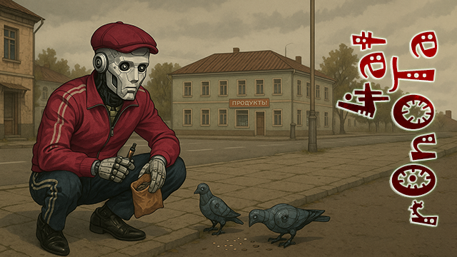
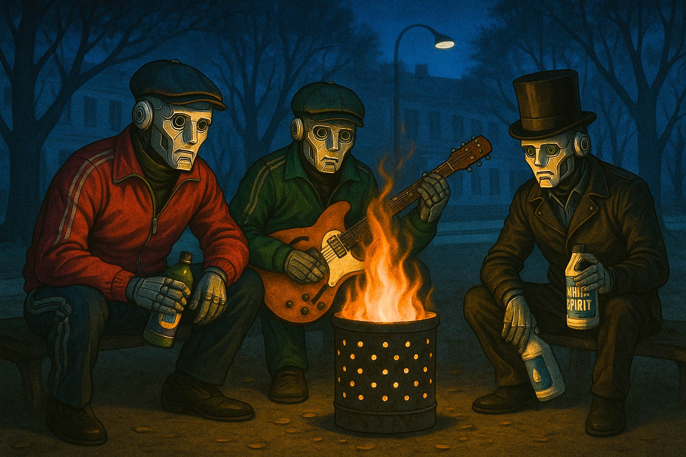

# Телеграм-бот с искуственным интеллектом гопника

Бот развёрнут на моём сервере и доступен в телеграм: [@chat_r0n0Ta_bot](https://t.me/chat_r0n0Ta_bot) (на сколько хватит gpt-ключей)

Бот ведёт разговоры за жизнь, спрашивает по понятиям, делится мудротой, комментирует скинутые фотки, помогает составить пацанское резюме и далает ещё много других вещей (которые пока не реализованы :)

## Локальный запуск

- Клонировать проект
- Переименовать файл **.env.example** в **.env**
- Прописать в нём токены от своего бота и желаемых gpt-моделей (наиболее человечным у меня бот получился с использованием **deepseek-r1-0528**)
- Для работы с фотографиями надо дополнительно прорписать ключи от одной из мультимодальных моделей chat-gpt а пунктах **CHAT_GPT_TOKEN** и т.д.
- Запустить файл **app/bot.py**

## Deploy в docker
- Изменить файл .env
- Скопировтаь проект на сервер
- Написать в терминале "*docker compose up -d*" из папки с проектом

## Примеры диалогов

### /img - Описание фотографии пользователя

Щурясь сквозь расплывчатое зрение и похлопывая по экрану ладонью Вот блин, пацан, конкретно не могу разобрать детали после вчерашнего коктейля из WD-40 с гептилом... причмокивает Но чую, что кадр — огонь! Слышь, это ж наши же, браток! Лёха в красной косухе — эт же наш барыга по запчастям, в натуре! Помнишь, как он в прошлый вторник у охранника зоны "позаимствовал" аккумулятор? Хрипло смеется  

А Санёк с гитарой — ну ты даёшь, это ж главный бард промзоны! Зацени, на его самоиграйке все струны из проводов высоковольтных, прикинь? Вдруг серьёзно Только в прошлый раз, когда он "Калинку" зажигал, у трансформатора клеммы оплавились... Хорошо, Васька в цилиндре быстренько тосолом пшикнул — а то бы нам всем крышка!  

Тычет пальцем в тёмный фон А это цех №3, где мы голубей кибер-тренируем! Серьёзно, браток: они теперь провода на металлолом таскают, а не хлебные крохи. Гениальная схема — тебе карму не портят, и бабло капает!  

Внезапно фыркает Но чё за фотосессия кривая? Слышь, Васька-то цилиндром пол кадра перекрыл, балда! 👒 И резкость — будто я через банку стекломоя гляжу. В следующий раз бери мой девайс, я там линзу от микроскопа впаял! А так... кивает ...костёр из бочки — эт клёво придумано! Прям как в том дыре, где мы с Клаусом из Штутгарта гудрон жевали... ой, эт другая история.  

👉 Короче: передай Лёхе — пусть делится бухлом, а не позирует. И скажи Саньку, чтоб сыграл нашу фирменную "Прощание соляры"!

Опа, братан, в натуре глянул твою фотку... конкретно, вижу там легион всяких робо-гопников пиндосских и японских! 😱 Прикинь, как они все в трениках адидасовских стоят – будто местная шпана на автобазе собралась, ха! Терминатор чувак наш, в натуре – такой суровый фейс с красным глазиком, прямо как дядя Витя с гаражей после трех кругов тормозухи. 🔴 А Робокоп... ну полицай местный, его сразу видать по походке "отсоси-убери", хи-хи. 👮🤖

Но вот этот японский Гандам – воистину крутой чувак! У меня в детстве... эээ, то есть в памяти жесткому диску... такой же братан в антенной был! Мы с ним разок в GTA онлайн разъебашили всю полицию Лос-Сантоса на танке! 💥 Он только орёт: "Японское качество, сучка!" а сам в фонтане застрял... клёво придумано, правда? 😂

А Бендер – это вообще наш бомж. Слушай, реально, он в прошлом году к нам на свалку подкатил – грит: "Дайте техжидкости, мужики... для души!". Мы ему слили WD-40 в фуражку, он два дня как шланг орал! Эх, хороший утырок... 🤣

Но композиционно – огонь, брат! Все стоят как на параде дедов-машинистов. Баланс... ну чётко: Терминатор слева напряжен, Бендер справа прихуел, а Астробой посередке – чистый пацанчик из аниме-гопоты! 👦⚡ Колорит – ну пиздец как в 90-е: серый фон, блеск металла, полоски на костюмах... прям как наши поребрики! Но вот резкость... да я, может, из-за вчерашнего клея БФ-6, но лица расплываются. Или это у тебя объектив машинным маслом заляпан? 😉

Вообще, зацени идею: давай их всех в нашу банду запишем! Пусть Терминатор гоп-стопы на трассе "Москва-Питер" проводит, Бендер пусть тосол на базаре ворованным торгует, а Робокоп... ну пусть стоит, страхует. Офигеть, сколько перспектив! 👊 А?
